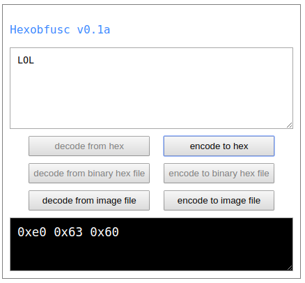

# BitsOps
Repo dedicated to notes on bitwise operators &amp; direct bits manipulation

# the EISA EDID edition tool is not yet written, only one helper that generates a valid manufacturer name from 3 chars

# for the Hexobfusc tool, visite the following link
https://cdn.rawgit.com/stephaneAG/BitsOps/master/encoderDecoderWip.html
R: to update it: https://developer.mozilla.org/en-US/docs/Web/API/Blob


## to thoroughly DIGG !
- http://graphics.stanford.edu/~seander/bithacks.html
- http://www.catonmat.net/blog/low-level-bit-hacks-you-absolutely-must-know/

## Reminders
_ &   -  bitwise and  
_ |   -  bitwise or  
_ ^   -  bitwise xor  
_ ~   -  bitwise not  
_ <<  -  bitwise shift left unsigned  
_ >>  -  bitwise shift right unsigned  
_ >>> -  bitwise shift right signed  

_ 0x.. - hex / base 16  
_ 0b.. - bin / base 2  

### Tips

### get the n bit
```javascript
(x>>n) & 1
```

### odd or even ?
```javascript
if ((x & 1) == 0) {
  // even
}
else {
  // is odd
}
```
### set n bit
```javascript
y = x | (1<<n)
```

### unset n bit
```javascript
y = x & ~(1<<n)
```

### toggle n bit
```javascript
y = x ^ (1<<n)
```

### is n bit set ?
```javascript
if (x & (1<<n)) {
  // n-th bit is set
}
else {
  // n-th bit is not set
}
// or
(x & (1<<n) != 0) ? 'set' : 'not set'
```

### turn off right-most set bit
```javascript
y = x & (x-1)
```

### turn on rigght-most unset bit
```javascript
y = x | (x+1)
```

### isolate right-most set bit
```javascript
y = x & (-x)
```

### isolate right-most unset bit
```javascript
y = ~x & (x+1)
```

### right propagate right-most set bit
```javascript
y = x | (x-1)
```

